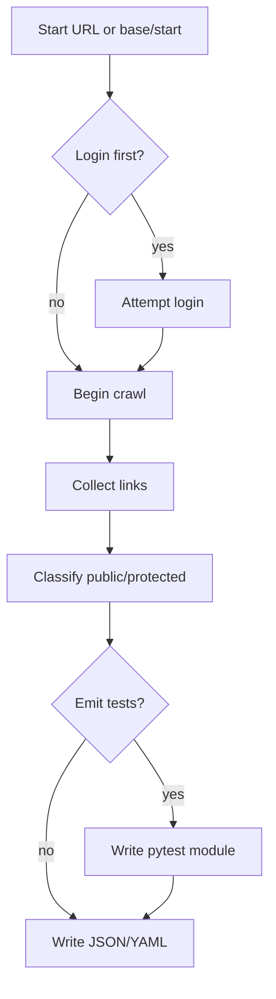

Auto-discovery routes for E2E

Quick start

- Discover from a URL
  - python tools/discover_routes.py --url https://host/login
  - The tool crawls internal links (bounded depth) and writes config/discovered/<site>.json

- Run smoke using discovered routes
  - SITE=<site> pytest -vv tests/smoke/test_routes.py --browser=chromium

Docker Makefile target

- make build
- make discover URL=https://host/login
- SITE=<site> pytest -vv tests/smoke/test_routes.py --browser=chromium

Flow diagram
------------

Notes

- If E2E_EMAIL/E2E_PASSWORD are set, the tool attempts a single login to better classify protected routes.
- The conftest auto-loads discovered JSON to populate PUBLIC_ROUTES/PROTECTED_ROUTES if not set by env.
- You can override with env vars anytime (env takes precedence).

